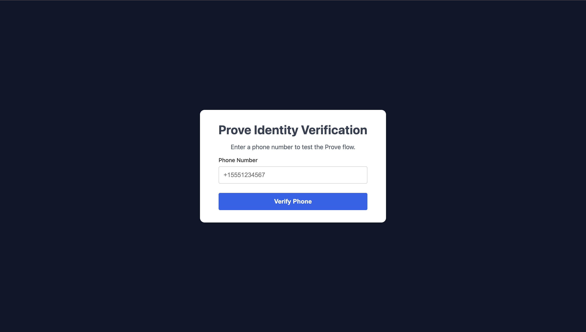

# Prove Identity Verification - Full-Stack React & Node.js App



This repository contains the source code for a full-stack web application demonstrating how to integrate Prove's Identity Verification services. The application consists of a React frontend built with Vite and a minimal Node.js/Express backend.

This project is the basis for the article "A Tutorial on Integrating Seamless Web Identity Verification with Prove's JavaScript SDK".

## Features

*   **Secure Backend:** A Node.js server that securely stores API credentials and communicates with the Prove API.
*   **Modern Frontend:** A responsive React UI built with Vite for a fast development experience.
*   **Prove JavaScript SDK Integration:** Demonstrates how to use the client-side SDK to handle different verification flows.
*   **Mobile vs. Desktop Flows:** The application correctly detects the user's environment and triggers the appropriate Instant Link (desktop) or OTP (mobile) flow.
*   **Full Verification Lifecycle:** Implements the `Start`, `Validate`, and `Complete` stages of the Prove Identity verification process.


## Tech Stack

*   **Backend:**
    *   [Node.js](https://nodejs.org/)
    *   [Express](https://expressjs.com/)
    *   [Prove API SDK (`@prove-identity/prove-api`)](https://www.npmjs.com/package/@prove-identity/prove-api)
    *   `dotenv` for environment variable management
    *   `cors` for enabling cross-origin requests

*   **Frontend:**
    *   [React](https://react.dev/)
    *   [Vite](https://vitejs.dev/)
    *   [Prove Auth SDK (`@prove-identity/prove-auth`)](https://www.npmjs.com/package/@prove-identity/prove-auth)
    *   [Axios](https://axios-http.com/) for API requests
    *   [React Router](https://reactrouter.com/) for client-side routing

## Prerequisites

Before you begin, ensure you have the following:

1.  **Node.js and npm:** Installed on your system ([LTS version recommended](https://nodejs.org/en/download)).
2.  **Prove Developer Account:** If you don't have one, [sign up for a free account](https://portal.prove.com/en/signup).
3.  **Prove API Credentials:** You will need your **Client ID** and **Client Secret** from your Prove dashboard.

## Getting Started

Follow these steps to get the project running locally.

### 1. Clone the Repository

```bash
git clone https://github.com/giftea/prove-js-sdk-example.git
cd prove-js-sdk-example
```

### 2. Backend Setup

First, set up and run the backend server.

1.  Navigate to the backend directory:
    ```bash
    cd prove-backend
    ```

2.  Install the required npm packages:
    ```bash
    npm install
    ```

3.  Create a `.env` file by copying the example file. See the **Configuration** section below for details on how to fill it out.
    ```bash
    cp .env.example .env
    ```

4.  **Important:** Edit the `.env` file and add your Prove API credentials.

5.  Start the backend server:
    ```bash
    node index.js
    ```
    The server will be running on `http://localhost:4000` (or the port you specify in `.env`). Keep this terminal window open.

### 3. Frontend Setup

Now, set up and run the frontend application in a **new terminal window**.

1.  Navigate to the frontend directory from the project root:
    ```bash
    cd prove-frontend
    ```

2.  Install the required npm packages:
    ```bash
    npm install
    ```

3.  Create a `.env` file. The repository includes an example file, which is usually all you need for local development.
    ```bash
    cp .env.example .env
    ```

4.  Start the frontend development server:
    ```bash
    npm run dev
    ```
    The React application will be available at `http://localhost:5173`.

## Configuration

### Backend (`/prove-backend/.env`)

This file configures the server and stores your secret credentials.

```
# .env

# Prove API Credentials (from your Prove developer account)
PROVE_CLIENT_ID="YOUR_PROVE_CLIENT_ID"
PROVE_CLIENT_SECRET="YOUR_PROVE_CLIENT_SECRET"

# Prove Environment 
# "uat-us" for Sandbox
# "prod-us" for Production
PROVE_ENV="uat-us" # Set to Sandbox

# User will be redirected to this URL, after clicking the Instant Link
FINAL_TARGET_URL="http://localhost:5173/verify-success"

# Server Port
PORT=4000
```

| Variable              | Description                                                               |
| --------------------- | ------------------------------------------------------------------------- |
| `PROVE_CLIENT_ID`     | **Required.** Your API Client ID from the Prove dashboard.                |
| `PROVE_CLIENT_SECRET` | **Required.** Your API Client Secret from the Prove dashboard.            |
| `PROVE_ENV`           | The Prove environment to use. Set to `uat-us` for testing.               |
| `FINAL_TARGET_URL`    | The URL the user is sent to after completing the mobile part of a desktop flow. |
| `PORT`                | The port your backend server will run on.                                 |

### Frontend (`/prove-frontend/.env`)

This file tells the React app where to find the backend API.

```
# .env
VITE_API_BASE_URL=http://localhost:4000
```

| Variable            | Description                                   |
| ------------------- | --------------------------------------------- |
| `VITE_API_BASE_URL` | The full URL of your running backend server.  |

## How to Test the Application

Once both servers are running, open `http://localhost:5173` in your browser and use the official Prove sandbox credentials to test the flow.

1.  **Enter Phone Number:** `2001004009`
2.  **Submit.** The next step depends on your testing environment:
    *   **Desktop Browser:** The flow will simulate an Instant Link and advance automatically.
    *   **Mobile Browser:** You will be prompted for an OTP. Enter `1234`.
3.  **Complete Verification:** When prompted for a name, enter:
    *   First Name: `Benji`
    *   Last Name: `Harper`
4.  **Submit.** You should see the success screen.

For more test cases and personas, refer to the [Prove Sandbox Testing documentation](https://developer.prove.com/docs/prove-identity-sandbox-testing).
